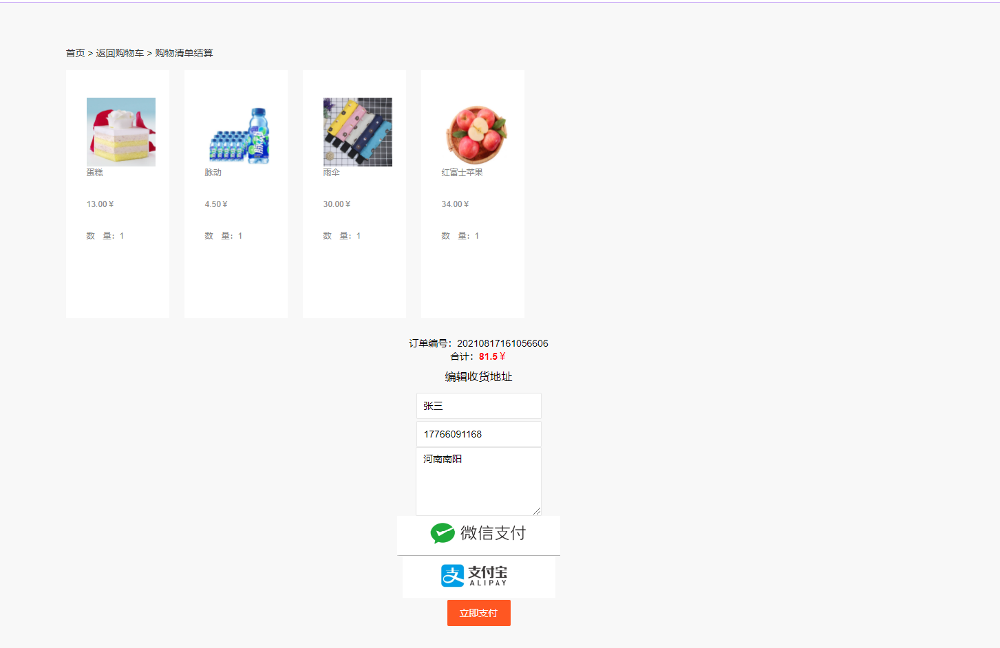

## 基于JSP+Servlet实现的网上商城系统

###  获取sql数据库文件: 从戎源码网 (https://armycodes.com/) QQ: 386869957 QQ群: 377586148
###  所有系统地址: (https://github.com/YuLin-Coder/AllProjectCatalog) 
###  所有项目以及源代码本人均调试运行无问题 可支持远程安装部署调试、定制修改、代码讲解

## 项目介绍
基于JSP+Servlet实现的网上商城系统，主要功能如下

登录系统后台：通过输入用户名和密码，管理员可以登录系统后台进行管理操作。
【管理员】
商品管理：管理员可以添加、修改、删除商品信息，包括商品的名称、价格、库存、描述等。
订单管理：管理员可以查看用户的订单信息，包括订单的状态、商品数量、总金额等，并可以进行订单的处理，如确认付款、发货、退款等。
用户管理：管理员可以查看用户的信息，包括用户名、联系方式、收货地址等，并可以对用户进行管理，如禁用用户、重置用户密码等。
数据统计：管理员可以查看商城的销售数据、用户活跃度等统计信息，帮助商城运营和决策。
网站设置：管理员可以对商城的基本设置进行调整，如网站名称、Logo、客服电话等。

【用户】
注册登录：用户可以通过注册账号的方式成为商城的会员，注册后可以使用账号密码登录系统。
商品浏览：用户可以浏览商城的商品，包括浏览商品分类、搜索商品、查看商品详情等。
购物车管理：用户可以将感兴趣的商品添加到购物车中，可以修改购物车的商品数量、删除商品等。
下订单：用户可以在选定商品后生成订单，包括选择商品规格、填写收货地址等。
在线支付：用户可以选择在线支付方式进行支付，如支付宝、微信支付等。
订单管理：用户可以查看自己的订单信息，包括订单状态、商品数量、总金额等，并可以进行一些操作，如取消订单、确认收货等。
评价商品：用户可以对购买的商品进行评价，并给出相应的评分和评论。

## 项目技术
- 编程语言：Java
- 数据库：MySQL
- 前端技术：JSP、JavaScript、bootstrap、JQuery
- 后端技术：Servlet、JDBC

## 运行环境
- JDK版本：JDK1.8及以上
- 开发工具：IDEA、Ecplise、Myecplise都可以
- 数据库: MySQL5.7及以上

## 运行截图

